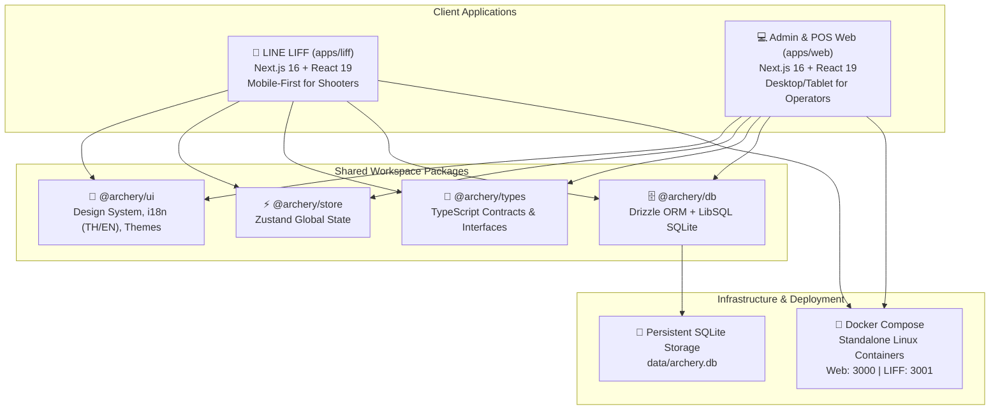
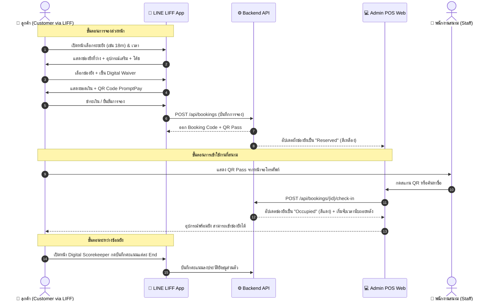

# 🎯 R-CHERY: Archery Range Management & Booking Platform
## เอกสารสถาปัตยกรรมระบบ ฟีเจอร์ และคู่มือสเปกสำหรับออกแบบ UI บน Google Stitch
*เอกสารฉบับสมบูรณ์สำหรับ Product Designers, UI/UX Engineers และทีมพัฒนา*

---

## 📌 สารบัญ (Table of Contents)
1. [ภาพรวมของโครงการ (Project Overview)](#1-ภาพรวมของโครงการ-project-overview)
2. [กลุ่มผู้ใช้งานและบทบาท (User Personas & Roles)](#2-กลุ่มผู้ใช้งานและบทบาท-user-personas--roles)
3. [สถาปัตยกรรมระบบและโครงสร้างเทคโนโลยี (System Architecture & Tech Stack)](#3-สถาปัตยกรรมระบบและโครงสร้างเทคโนโลยี-system-architecture--tech-stack)
4. [โครงสร้างโมดูลและฟังก์ชันการทำงาน (Core Features & Functional Modules)](#4-โครงสร้างโมดูลและฟังก์ชันการทำงาน-core-features--functional-modules)
5. [User Journey & Workflows (ขั้นตอนการใช้งานหลัก)](#5-user-journey--workflows-ขั้นตอนการใช้งานหลัก)
6. [Design System & UI Tokens สำหรับ Google Stitch](#6-design-system--ui-tokens-สำหรับ-google-stitch)
7. [Screen Specifications & Stitch Prompts (พร้อมใช้งานบน Google Stitch)](#7-screen-specifications--stitch-prompts-พร้อมใช้งานบน-google-stitch)

---

## 1. ภาพรวมของโครงการ (Project Overview)

**R-CHERY** คือแพลตฟอร์มระบบบริหารจัดการสนามยิงธนูและระบบจองช่องยิงแบบ Multi-tenant (SaaS) แบบครบวงจร ออกแบบมาเพื่อยกระดับวงการกีฬายิงธนูให้ทันสมัย เชื่อมโยงระหว่าง **"นักยิงธนู" (Shooter)** และ **"ผู้ดูแลสนาม" (Range Admin/Staff)** เข้าด้วยกันอย่างราบรื่น

### 🎯 ปัญหาที่ระบบเข้ามาแก้ไข (Pain Points Solved)
1. **การจองซ้อนและช่องยิงชนกัน**: การจัดการด้วยกระดาษหรือแชทไลน์แบบเดิมเกิดความสับสนเรื่องระยะยิง (10m, 18m, 30m, 50m, 70m) และประเภทคันธนู
2. **การเช่ายืมอุปกรณ์ไม่เป็นระบบ**: ไม่ทราบสต็อกคันธนู (Recurve/Compound/Barebow), น้ำหนักแรงดึง (Draw Weight), และความถนัดซ้าย/ขวา
3. **ความปลอดภัยและเอกสารยินยอม (Safety Waiver)**: การเซ็นเอกสารกระดาษสูญหายง่าย R-CHERY เปลี่ยนเป็น Digital Signature บนมือถือก่อนเข้ายิง
4. **ขาดเครื่องมือบันทึกคะแนนส่วนตัว**: ผู้เล่นต้องจดกระดาษ R-CHERY มีเป้าจำลอง Digital Scorekeeper คำนวณคะแนนและสถิติ End by End อัตโนมัติ

---

## 2. กลุ่มผู้ใช้งานและบทบาท (User Personas & Roles)

| บทบาท (Role) | ช่องทางการใช้งาน | เป้าหมายหลัก (Goals) |
| :--- | :--- | :--- |
| **1. ลูกค้า / นักยิงธนู (Customers & Members)** | **LINE LIFF App** (Mobile Webview) | จองช่องยิงล่วงหน้า เลือกระยะ/อุปกรณ์/โค้ช ชำระเงินผ่าน PromptPay เซ็น Waiver เช็คอินด้วย QR Code และบันทึกคะแนนยิง |
| **2. ผู้ดูแลสนาม / แคชเชียร์ (Shop Admin & Staff)** | **Web POS & Dashboard** (Desktop / Tablet) | ดูสถานะช่องยิงแบบ Real-time Grid, รับลูกค้า Walk-in, สแกน QR เช็คอิน, ขยายเวลาช่องยิง, ตัดยอดสต็อกอุปกรณ์ และดูสรุปยอดรายได้ |
| **3. เจ้าของแพลตฟอร์ม (Platform SuperAdmin)** | **Web SuperAdmin Console** (Desktop) | อนุมัติและสร้างสนามใหม่ (Tenant Onboarding), จัดการแพ็กเกจสมาชิก SaaS (Starter, Pro, Enterprise), และดูภาพรวมการใช้งานทั้งระบบ |

---

## 3. สถาปัตยกรรมระบบและโครงสร้างเทคโนโลยี (System Architecture & Tech Stack)

โครงสร้างโครงการใช้แบบ **Monorepo** เพื่อให้แชร์ Component, Types, State, และ Database schema ร่วมกันระหว่าง Customer LIFF และ Admin Web ได้ 100%



### รายละเอียด Tech Stack:
- **Core Framework**: Next.js 16.3.4 (Standalone Output, Webpack Engine), React 19, TypeScript 5
- **Styling**: Tailwind CSS v4, Glassmorphism, CSS Custom Properties, Athletic Micro-interactions
- **Monorepo Engine**: Turborepo 2.10
- **Database & ORM**: SQLite (LibSQL Client) ขับเคลื่อนด้วย Drizzle ORM
- **State Management**: Zustand (Multi-step Booking, Real-time Lane Status, Cart, Score Tracker)
- **Deployment**: Multi-stage Dockerfile (Node 22 Slim) แยกพอร์ต Web: 3000 และ LIFF: 3001

---

## 4. โครงสร้างโมดูลและฟังก์ชันการทำงาน (Core Features & Functional Modules)

### 📱 โมดูลที่ 1: LINE LIFF Customer Experience (`apps/liff`)
1. **Shop Profile & Hero**:
   - แสดงโลโก้สนาม, แท็กไลน์, ที่อยู่, เวลาทำการ (Open/Close Hours)
   - เมนูนำทางแบบ Mobile Navigation Bar (Home, Booking, Scores, My Pass)
2. **Dynamic Multi-Step Booking Wizard**:
   - **Step 1 (Date & Duration)**: ปฏิทินเลือกวันที่ และเลือกระยะเวลาการซ้อม (1 ชม., 2 ชม., ฯลฯ)
   - **Step 2 (Lane Selection)**: เลือกช่องยิงตามระยะ (10m, 18m, 30m, 50m, 70m) และประเภทคันธนูที่รองรับ แสดงสถานะว่าง/ไม่ว่างแบบ Visual Card
   - **Step 3 (Equipment Add-ons)**: เช่าคันธนู (Recurve/Compound/Barebow พร้อมระบุ Draw Weight lbs และมือขวา/ซ้าย), เช่าลูกธนู, Finger Tab, Arm Guard
   - **Step 4 (Coach Booking)**: เลือกเทรนเนอร์/โค้ชประกบส่วนตัว พร้อมแสดงเรทราคาและภาพโปรไฟล์
   - **Step 5 (Digital Waiver & Signature Canvas)**: กฎความปลอดภัยของสนาม พร้อมพื้นที่เซ็นลายเซ็นดิจิทัลด้วยปลายนิ้ว (Touch Canvas)
   - **Step 6 (PromptPay QR & Checkout)**: สร้าง QR Code ยอดรวม พร้อมปุ่มบันทึก QR หรือแนบสลิปโอนเงิน
3. **Interactive Target Face Scorekeeper**:
   - เป้าจำลองมาตรฐาน World Archery 10 วง (Gold X/10/9, Red 8/7, Blue 6/5, Black 4/3, White 2/1, M)
   - บันทึกคะแนนทีละ End (3 หรือ 6 ลูก), คำนวณคะแนนรวม, Average per arrow, และบันทึกประวัติการยิงลงฐานข้อมูล
4. **Digital Pass & QR Check-in**:
   - แสดงบัตรคูปองจองพร้อม QR Code ขนาดใหญ่ สำหรับยื่นให้เคาน์เตอร์สแกนเช็คอินทันที

---

### 💻 โมดูลที่ 2: Shop Management & Web POS (`apps/web/admin/[slug]`)
1. **Live Lane Matrix (ผังช่องยิง Real-time)**:
   - ตารางกริดแสดงช่องยิงทุกช่อง (Lane 1 ถึง Lane N)
   - สีบ่งบอกสถานะชัดเจน:
     - 🟢 **Available (ว่าง)**: กดคลิกเปิด Walk-in ได้ทันที
     - 🟡 **Reserved (จองล่วงหน้า)**: แสดงชื่อและเวลานัดหมาย
     - 🔴 **Occupied (กำลังยิง)**: มีตัวเลขนับเวลาถอยหลัง (Live Countdown Timer)
     - ⚙️ **Maintenance (ปิดปรับปรุง)**: เป้าชำรุดหรือซ่อมแซม
   - ปุ่ม Quick Action: **Extend Time (+30 min, +60 min)**, **Change Lane (ย้ายช่อง)**, **Finish Session (คืนช่องยิง)**
2. **Walk-in Fast Checkout**:
   - สำหรับลูกค้าหน้าร้านที่ไม่ได้จองผ่าน LINE LIFF แคชเชียร์สามารถคีย์ข้อมูล เปิดช่องยิง และออกใบเสร็จได้ใน 3 คลิก
3. **QR Check-in Scanner**:
   - สแกน QR Code จากโทรศัพท์ลูกค้า ระบบจะดึงข้อมูลการจองและเปลี่ยนสถานะช่องยิงเป็น Occupied พร้อมเริ่มนับเวลาอัตโนมัติ
4. **Equipment Inventory Control**:
   - คลังอุปกรณ์ยิงธนู: ตรวจสอบจำนวนคันธนูที่กำลังถูกใช้งาน และจำนวนคงเหลือในคลัง
5. **Coach Schedule & Roster**:
   - ตารางเวลาโค้ชในแต่ละวัน แสดงสถานะว่าง/ติดสอน
6. **Membership & Package Manager**:
   - บัตรสมาชิกรายเดือน, แพ็กเกจคูปอง 10 ครั้ง (Punch-card), เช็คโควต้าคงเหลือของลูกค้า

---

### 🌐 โมดูลที่ 3: Platform SuperAdmin & Onboarding (`apps/web/superadmin`)
1. **Shop Directory**: รายการสนามยิงธนูทั้งหมดในแพลตฟอร์ม พร้อมตัวบ่งชี้สถานะ Subscription
2. **Tenant Onboarding Form (`/register-shop`)**: ฟอร์มลงทะเบียนเปิดสนามใหม่ ตั้งชื่อ Slug, สีแบรนด์, เวลาเปิด-ปิด, และผังช่องยิง
3. **Plan Management**: ปรับสิทธิ์การใช้งาน (Starter: 4 ช่อง, Pro: 12 ช่อง, Enterprise: ไม่จำกัด)

---

## 5. User Journey & Workflows (ขั้นตอนการใช้งานหลัก)



---

## 6. Design System & UI Tokens สำหรับ Google Stitch

การออกแบบ UI สำหรับ **R-CHERY** ต้องเน้นความรู้สึก **Athletic Precision, Dark Range Ambiance, High-Contrast Tactile Controls** (ไม่ใช้ AI Gradient ม่วงชมพูเลอะเทอะ หรือดีไซน์เรียบแบนไร้มิติ)

### 🎨 Color Palette & Hex Codes
| Token Name | Hex Code | ความหมายและการใช้งาน |
| :--- | :--- | :--- |
| `--color-brand-dark` | `#060e1a` | สีพื้นหลังหลัก (Deep Range Obsidian) ให้บรรยากาศสนามยิงธนูในร่มระดับโปร |
| `--color-brand-navy` | `#09172c` | สีการ์ดและพาเนล (Glass Card Navy Surface) ซ้อนบนพื้นหลังเพื่อสร้าง Layer มิติ |
| `--color-brand-blue` | `#074c88` | สีแบรนด์หลัก (Cobalt Bow Blue) สำหรับปุ่ม Action หลัก, Tab Active, Header Highlight |
| `--color-brand-cyan` | `#10516e` | สีรอง (Deep Cyan Target Ring) ใช้กับ Badge อุปกรณ์, ขอบสถานะรอง |
| `--color-brand-gold` | `#f9c701` | สีทองเหรียญรางวัล (Championship Gold) สำหรับคะแนน 10-Ring/Bullseye, VIP Badge, Star Rating |
| `--color-brand-red` | `#db1219` | สีแดงเป้าธนู (Precision Target Red) สำหรับคะแนน 8-9 Ring, สถานะ Occupied, แจ้งเตือนเวลาใกล้หมด |
| `--color-foreground` | `#f8fafc` | สีตัวหนังสือหลัก (Crisp Pure Off-White) คมชัด อ่านง่ายในที่แสงน้อย |

### 📐 Typography & Styling Principles
- **Display Headings**: ตัวหนา สง่างาม คมชัด ให้ความรู้สึกกีฬาแข่งขันสากล (Font: `Outfit`, `Oswald` หรือ `Inter`)
- **Body & Thai Localization**: คมชัด อ่านสบายตา ไม่เบลอ (Font: `Noto Sans Thai` หรือ `Inter`)
- **Athletic Digits (ตัวเลขคะแนนและเวลา)**: ฟอนต์แบบ Monospace หรือ Tabular Figures สำหรับเวลานับถอยหลังและสกอร์บอร์ด
- **Surface Texture**:
  - `Glass-Card`: พื้นหลังโปร่งแสง `rgba(9, 23, 44, 0.7)` ผสาน Backdrop Blur 16px
  - `Hairline-Border`: เส้นขอบบางเฉียบ `1px solid rgba(255, 255, 255, 0.08)` สะท้อนความแม่นยำระดับมิลลิเมตร
  - `Range-Grid`: เส้นไกด์เล็งระยะยิงจางๆ สไตล์ Blueprint บนผังช่องยิง

---

## 7. Screen Specifications & Stitch Prompts (พร้อมใช้งานบน Google Stitch)

ด้านล่างนี้คือ Prompt รายหน้าจอที่จัดโครงสร้างไว้ให้คุณสามารถ **คัดลอก (Copy) ไปวางใน Google Stitch** ได้ทันที:

---

### 🖥️ Prompt 1: Admin Live Lane Matrix & POS Dashboard (Desktop 1440x900)

```text
Create a modern, high-precision Archery Range POS & Live Lane Matrix Dashboard for "R-CHERY" on a 1440x900 desktop screen.

Design Aesthetic:
- Professional athletic precision theme. Dark obsidian background (#060e1a) with deep navy translucent glass panels (#09172c with 1px border rgba(255,255,255,0.08)).
- Vibrant archery target accent colors: Cobalt Blue (#074c88), Championship Gold (#f9c701), and Target Red (#db1219).
- Clean architectural range grid background pattern. No generic purple AI gradients.

Header Section:
- Top bar showing R-CHERY logo with sleek arrowhead emblem, shop switcher dropdown ("ArrowTech Archery Club - Bangkok"), current date/time in digital mono clock, Quick Walk-in button (+ Walk-in Booking in gold accent), and Staff Profile avatar.

Main Content Area:
1. Top KPI Metric Cards (4 cards):
   - Active Shooters (14/16 Lanes Occupied - 87%)
   - Upcoming Bookings Today (28 Bookings)
   - Equipment Rented Out (18 Bows, 64 Arrows)
   - Today's Revenue (฿18,450 THB with mini sparkline chart)

2. Live Lane Matrix Grid (12-16 Lane Cards in a responsive grid):
   - Each card represents a shooting lane:
     * Header: "Lane 03 • 18m Target" with badge (Recurve/Compound).
     * Status indicator with high visual contrast:
       - OCCUPIED (Red border & badge #db1219): Showing customer name "K. Thanawat S.", large digital countdown timer "00:24:15 remaining", and rental bow info ("Cartel Recurve 28#").
       - RESERVED (Yellow badge #f9c701): "Reserved at 15:00 • Sarah Connor".
       - AVAILABLE (Green/Cyan badge): "+ Click to Assign Walk-in".
       - MAINTENANCE (Muted dark grey): "Target Face Replacement".
     * Quick Action Buttons on hover/active: "+30m Extend", "Change Lane", "Check-out".

3. Right Sidebar - Quick Operations:
   - "Scan Check-in QR" camera viewfinder box or manual 6-digit booking code input.
   - Recent check-in feed with customer avatars and lane assignments.
```

---

### 📱 Prompt 2: Mobile LIFF Step-by-Step Lane Booking (Mobile 390x844)

```text
Design a mobile-first archery lane booking wizard for LINE LIFF application (390x844 iPhone resolution) for "R-CHERY".

Design Aesthetic:
- Dark sleek athletic interface. Background #060e1a with frosted dark blue cards (#09172c, 80% opacity, blur 16px, hairline white border).
- Brand accents: Cobalt Blue (#074c88) for primary CTA buttons, Gold (#f9c701) for selected highlights, White (#f8fafc) for high-contrast typography.
- Mobile friendly touch targets (minimum 48px height), bottom-anchored sticky checkout bar.

Screen Layout:
1. Top Navigation:
   - Back arrow, Shop Title "ArrowTech Club", and a 5-step horizontal progress bar showing current active step (Step 2: Select Lane).

2. Date & Time Selector Strip:
   - Horizontal date picker pills (Today, Tomorrow, Wed 10, Thu 11) with active date highlighted in gold.
   - Time slots grid (13:00, 14:00, 15:00, 16:00, 17:00) with badge indicating remaining slots.

3. Distance & Lane Filter Tabs:
   - Segmented pills: "All Distances", "10m Beginner", "18m Standard Olympic", "30m Intermediate", "50m/70m Pro".

4. Lane Cards List (Vertical scroll):
   - Card example: "Lane 04 - 18m Standard Olympic"
     * Tags: [Recurve & Barebow] [Max 2 Shooters]
     * Price: ฿250 / hour
     * Availability visual bar: 3 slots available this afternoon
     * Radio selector button to select this lane.

5. Equipment Add-on Toggle Drawer (Accordion):
   - "Need Bow & Gear?" toggle switch.
   - When opened: Shows bow selector chips (Recurve 20 lbs Right-Hand, Compound 35 lbs, Armguard + Finger Tab +฿100).

6. Sticky Bottom Action Bar:
   - Total calculation: "Total: ฿350 • 1 hr, 1 shooter"
   - Large prominent primary button: "Continue to Safety Waiver →" with vibrant blue glow.
```

---

### 📱 Prompt 3: Mobile LIFF Digital Waiver & PromptPay Checkout (Mobile 390x844)

```text
Design the Digital Safety Waiver and Payment Checkout screen for "R-CHERY" Archery Booking System on mobile (390x844).

Design Aesthetic:
- Dark theme #060e1a, high legibility safety compliance UI with glassmorphic cards.
- Accents: Gold (#f9c701) for verification badges, Cobalt Blue (#074c88) for primary submit button, Emerald Green for verified payments.

Screen Sections:
1. Header:
   - "Safety Agreement & Payment" with step indicator 4 of 4.

2. Range Safety Regulations Box (Scrollable glass panel):
   - Caution badge with shield icon.
   - 4 concise safety rules (e.g., "Never dry-fire a bow", "Only draw bow pointing towards the target", "Wait for all-clear whistle to retrieve arrows").
   - Checkbox: "I have read and agree to follow all range safety rules and terms of service."

3. Digital Signature Canvas:
   - Signature box with subtle dotted dashed border and dark slate background.
   - Placeholder text: "Sign your legal signature here with your finger".
   - Clear signature button (small icon top-right).
   - Shows a realistic smooth white handwritten digital signature trace.

4. PromptPay QR Payment Section:
   - High-contrast white QR Code card embedded inside navy glass container.
   - Thai PromptPay Logo at top of QR.
   - Amount clearly displayed: "฿450.00 THB".
   - "Download QR Code" button and "Upload Payment Slip" file dropzone area.

5. Sticky Bottom Button:
   - "Confirm Booking & Generate Pass" (Full-width button, blue with gold subtle rim).
```

---

### 📱 Prompt 4: Mobile LIFF Interactive Target Face Scorekeeper (Mobile 390x844)

```text
Design a professional interactive archery Digital Scorekeeper screen for mobile devices (390x844) inside "R-CHERY".

Design Aesthetic:
- Dark range atmosphere (#060e1a). Centered around a realistic World Archery 10-ring target face graphic.
- Crisp athletic sports HUD (Heads-Up Display) feel.

Screen Layout:
1. Session Header:
   - "Live Scoring • End 3 of 10" | "18m Indoor Round" | Total Score: "57 / 60" (Large gold number).

2. Archery Target Face (Center Stage):
   - Vector circular target face with official ring colors:
     * Inner Gold Ring: X (10+), 10
     * Outer Gold Ring: 9
     * Red Rings: 8, 7
     * Blue Rings: 6, 5
     * Black Rings: 4, 3
     * White Rings: 2, 1
   - Visual arrow impact markers (small bright neon cyan dots with drop shadows) showing where the 3 arrows landed in the current end.

3. End Arrow Scoring Row:
   - 3 circular score badges for current end: [ 10 ] [ 9 ] [ X ] = End Total: "29".

4. Score Keypad (Bottom half):
   - Grid of quick tap buttons matching ring colors:
     * Gold buttons: [ X ] [ 10 ] [ 9 ]
     * Red buttons: [ 8 ] [ 7 ]
     * Blue buttons: [ 6 ] [ 5 ]
     * Black buttons: [ 4 ] [ 3 ]
     * White buttons: [ 2 ] [ 1 ]
     * Dark button: [ M (Miss) ]
   - Undo button and Next End button ("Save & Next End →").

5. Mini Scorecard Drawer (Expandable bottom sheet):
   - Table showing Ends 1 to 10 with running total and arrow average (9.5 avg).
```

---

### 📱 Prompt 5: Digital Archery Pass & QR Check-in Ticket (Mobile 390x844)

```text
Design a high-end Digital Archery Pass / Ticket screen on mobile (390x844) for "R-CHERY" customers to present at the range reception.

Design Aesthetic:
- Luxurious modern sports pass card aesthetic (like an Apple Wallet VIP event pass).
- Dark navy carbon fiber / glass card texture with gold foil stamped hairline borders and target ring watermark in background.

Card Features:
1. Pass Header:
   - "R-CHERY PASS" with gold championship emblem.
   - Shop Name: "ArrowTech Club - Sukhumvit".
   - Booking Status: "CONFIRMED • READY FOR CHECK-IN" in bright emerald green pill.

2. Central Shooting Details:
   - Date & Time: "Wed, 10 Sep 2026 • 15:00 - 16:00"
   - Assigned Lane: "LANE 05 (18m Olympic)"
   - Equipment: "Cartel 68/26# Recurve + 6 Carbon Arrows"

3. Large QR Code Area (Center):
   - Crisp white QR code card with rounded corners and high scannability.
   - Booking Reference Code below QR: "#RC-89214".
   - Helper text: "Show this QR code to the cashier to unlock your lane and equipment".

4. Bottom Card Actions:
   - "Save to Apple Wallet" / "Save Image" icon buttons.
   - "Open Range Directions (Google Maps)" button.
   - "Cancel / Reschedule Booking" link.
```

---

## 8. วิธีการนำ Prompt ไปใช้งานบน Google Stitch

1. **เข้าสู่ระบบ Google Stitch**: เปิดเครื่องมือออกแบบของ Google Stitch ในเบราว์เซอร์
2. **เลือกขนาด Canvas**:
   - สำหรับหน้า **Admin POS**: เลือก Preset **Desktop (1440 x 900)** หรือ **Desktop 16:9**
   - สำหรับหน้า **LIFF Customer**: เลือก Preset **Mobile (390 x 844)** หรือ **Mobile 9:16**
3. **วาง Prompt**: คัดลอกข้อความในกล่อง `Prompt 1` ถึง `Prompt 5` ด้านบน วางลงในช่อง Input Prompt ของ Google Stitch
4. **กำหนด Reference Color**: คุณสามารถระบุ Hex Code: `#060e1a` (Background), `#074c88` (Primary Blue), `#f9c701` (Championship Gold) เพื่อให้ AI คุมโทนสีตาม Design System ของ R-CHERY อย่างแม่นยำ
5. **Export & Iterate**: นำ Component และ Layout ที่ Google Stitch สังเคราะห์ออกมานำไปพัฒนาต่อยอดในโปรเจกต์ `apps/web` และ `apps/liff` ได้ทันที

---
*เอกสารนี้ถูกสร้างและตรวจสอบความสอดคล้องกับซอร์สโค้ดและสถาปัตยกรรม Monorepo ของโครงการ R-CHERY เรียบร้อยแล้ว*
